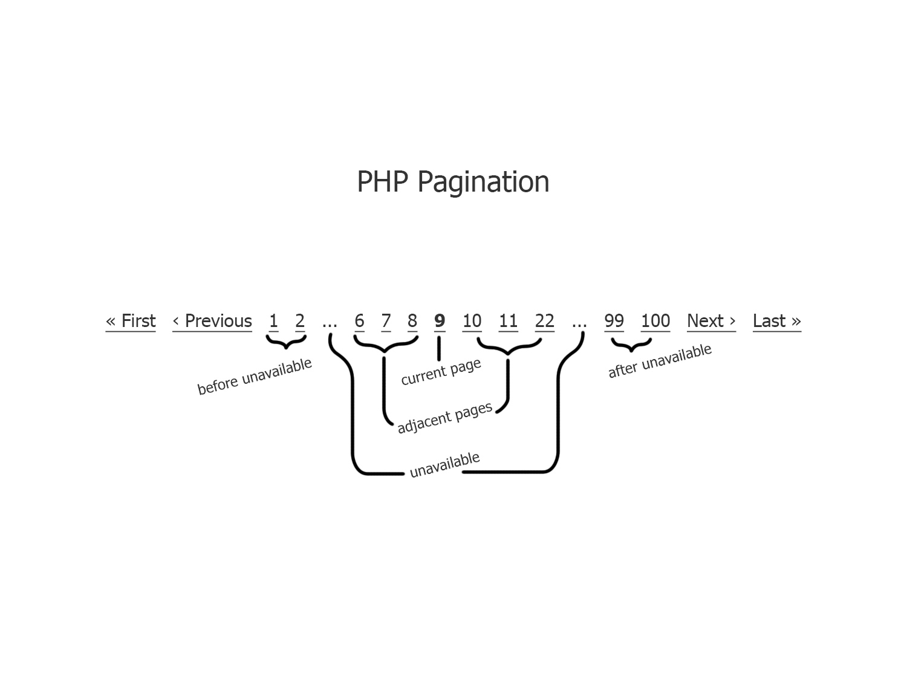

# Pagination Component

PHP Pagination.<br>
The highly customizable PHP pagination class.

[](https://packagist.org/packages/rundiz/pagination)
[](https://packagist.org/packages/rundiz/pagination)
[](https://packagist.org/packages/rundiz/pagination)

Example:
```php
// You don't need to include or require file if you install via Composer.
require_once '../Rundiz/Pagination/Pagination.php';

$total_records = 1000;
$start = (isset($_GET['start']) ? intval($_GET['start']) : 0);
if ($start < 0) {
    $start = 0;
}
$limit = 10;

$Pagination = new \Rundiz\Pagination\Pagination();
// Set options to the pagination class.
$Pagination->base_url = 'http://localhost/your-project/page.php?start=%PAGENUMBER%';// *This property must be set.
$Pagination->total_records = $total_records;// *This property must be set.
$Pagination->page_number_value = $start;// *This property must be set.
echo $Pagination->createLinks();
```

More example is in tests folder.

# Pagination parts description


* "before unavailable" items number can be set via "unavailable_before" property. Example: `$Pagination->unavailable_before = 1;`
* "unavailable" text can be set via "unavailable_text" property. Example: `$Pagination->unavailable_text = '..';`
* "adjacent pages" can be set the number via "number_adjacent_pages" property. Example: `$Pagination->number_adjacent_pages = 3;`
* "after unavailable" items number can be set via "unavailable_after" property. Example: `$Pagination->unavailable_after = 2;`
